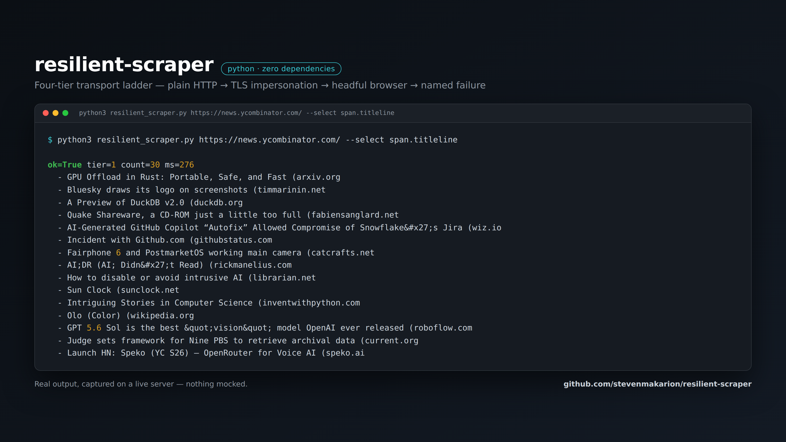

# resilient-scraper



A scraper that survives the modern web, and tells you the truth when it doesn't.

Most "my scraper stopped working" jobs are one of four failures. This is the escalation
ladder that handles all four, cheapest transport first, and returns an auditable manifest
either way.

```
TIER 1   plain HTTP + real headers ....... ~70% of sites, ~200ms
TIER 2   TLS impersonation ............... defeats JA3/JA4 fingerprint walls
TIER 3   headFUL browser on Xvfb ......... defeats headless detection, renders JS
TIER 4   named failure WITH evidence ..... never a silent empty result
```

```
$ python3 resilient_scraper.py "https://old.reddit.com/r/forhire/new/" --select "a.title"
ok=True tier=1 count=25 ms=1002

$ python3 resilient_scraper.py "https://news.ycombinator.com/" --select "span.titleline"
ok=True tier=1 count=30 ms=408
```

## The two findings this encodes

**1. Headless is the fingerprint that gets you blocked — not your IP.**
Measured on one host inside one minute: `old.reddit.com` served **HTTP 200** to plain
`curl` and **"You've been blocked by network security"** to headless Chrome. Same address,
same second. Teams routinely conclude a site is unscrapable when the actual problem is that
they reached for `--headless` first. Tier 3 here runs a *real* browser window on a virtual
display (Xvfb) with `AutomationControlled` disabled.

**2. Some walls are the TLS handshake, and no header can fix them.**
On a production job pulling public surplus-auction data, every ordinary client got 403
while `curl_cffi` impersonating a real Chrome TLS fingerprint walked through first try.
If a site 403s a perfect-looking request, suspect JA3/JA4 before you suspect your headers.

## Why the manifest matters

A scrape returns a dict, never a bare list:

```json
{
  "ok": true, "url": "...", "tier": 1, "ms": 1002, "count": 25,
  "data": [...],
  "attempts": [],
  "scraped_at": "2026-08-17T15:02:11"
}
```

And on failure, every attempt is recorded with its tier, try number, error and timing.
**A scrape you cannot audit is a scrape you cannot bill for** — and "it returned nothing"
is not a bug report. This tells you *which* wall you hit.

## Also in the box

Polite rate limiting. Exponential backoff on transient errors (but *not* on a confirmed
block — retrying a block is just a slower block). Structured JSON output. Zero third-party
dependencies for tiers 1 and 4; tier 2 wants `curl_cffi` and degrades honestly without it.

## Usage

```bash
resilient_scraper.py URL --select "a.title" --out results.json
resilient_scraper.py URL --tier 3          # force the browser lane
```

The extractor is deliberately dependency-free and handles the common `tag.class` cases;
real jobs get a proper parser. This is honest about what it is.

MIT licensed.
